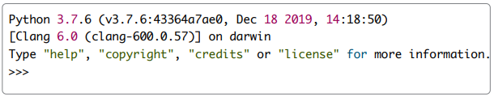

# Analytics_Paradigm
This repository follows/documents the UT Data Analytics Certificate Program. 

### Purpose
The goal is to develop a general data analytics paradigm. Throughout this process, we'll discover new programs/software, terminology, and a novel set of skills that can be applied to various projects.

## Definitions
   - **Command Line** - The command line is used to navigate and perform tasks on a computer. (macOS) Terminal Application. (Windows) Command Prompt.
   - **Github Repository** - 
   - **Interpreter** - 
   - **Git Bash** - An app for Microsoft Windows environments that installs Bash (Bourne-again shell) and Git on Windows OS.
   - **Shell** - A terminal application, like Terminal on macOS, used to interface with an OS through written commands.
   - **Homebrew** - 
   - **Xcode** - 
   - **Dependencies** - 

### Commands
- **pwd** - Present working directory
- **ls** - list files

## The Terminal Application

### Opening the Terminal Application - macOS
   1. Press Command+Space to open Spotlight Search.
   2. Type "Terminal" into the search bar and press Enter.
   3. Next, select the Terminal application to launch it. You can save Terminal to your dock for easy access.

### Using the Terminal Application
The terminal on my screen shows the following:

Last login: Fri Oct  1 00:35:18 on console
daniellaandrobert@Daniellas-iMac ~ % 

The first line shows the details of the last login. The second line provides the name of the computer (in this case, daniellaandrobert@Daniellas-iMac). The second part, ~ %, has three key parts:

   1. The squiggly line, **~**, is how the computer lets us know we are in the home directory.
   2. The name "daniellaandrobert" is the name of the home directory. The home directory on a Mac is the little house that appears in the sidebar of the Finder window under Favorites.
   3. The $ is what programmers call the prompt, which is where we will type commands.

### Finding Your Home Directory
Every time you open the terminal application, it will open in the home directory. Using commands, we can find the terminal "path" to the home directory.

To find the path to your home directory (or any directory), enter the command pwd after the prompt, $. Then press Enter to run, or execute, the command.  pwd stands for "print working directory." The working directory is the current directory you are working in. For example, right now we are working in the home directory. After we run the pwd command, the computer responds with current folder in use.

The command to view files and folders in the terminal is ls which means "list files." If we type ls after the prompt and press Enter, the terminal will print the folder names in alphabetical order from top to bottom and right to left.

### Navigating with the Terminal Application
To navigate to a folder - for example Downloads - type cd Downloads. The cd command means "change directory."

To nagative to a new folder type cd .. The two dots after cd tells the computer to go back one level, which, in our case, is the home directory. ext, he would type cd Desktop and press Enter. Now Tom would be in his Desktop directory, or folder.

Typing 'cd ~' returns a user to the main directory - the desktop folder.

A technique used by more experienced programmers is to type cd ../Desktop after the prompt and then press Enter. This command allows you to go back one directory, or folder, level from the Downloads directory to the home directory, and then navigate to the Desktop folder. Let's break this command down in detail.

   - The cd .. tells the computer to go back up one level.
   - The forward slash "/" is a path separator.
   - After the forward slash, we add the directory or folder, Desktop.

## Install Homebrew and Git
**What is Homebrew?** 
“Homebrew installs the stuff you need that Apple didn’t” — this is how Homebrew creators describe it, and we agree. If you want a more informative definition, Homebrew is a free and open-source package manager for macOS, helping you install, update, uninstall, and manage developer tools like Python, Ruby, and Node.js on your Mac. 

**Why do you need it?** 
With Homebrew, you can benefit from tons of command line tools to automate your work. Best of all, they are all installed, uninstalled, and updated in one location on your Mac.

**How Homebrew works**
Homebrew acts through Terminal commands — you can install, update, and uninstall packages by typing a few words. There are some simple default brew commands for installing single-file utilities, and more advanced subcommands called casks — you’ll have to use those to install multi-directory utilities.

**Source**
https://setapp.com/how-to/install-homebrew-on-mac?ci=13920502941&adgroupid=124514958203&adpos=&ck=&targetid=dsa-1391463663744&match=b&gnetwork=g&creative=534108519533&placement=&placecat=&accname=setapp&gclid=CjwKCAjw7--KBhAMEiwAxfpkWJiR_rRDXmGEfpSgB1pk96rFYGR5M89DnE_yi3zEnhzTvqnB_7KaeBoCVGwQAvD_BwE

### How to install Homebrew and git on Mac
**Step 1**: Install command line tools for Xcode

Xcode is Apple’s native IDE, an integrated development environment that has all the tools you need for software development on Mac. To install some of the Homebrew package components, you need to install Xcode’s command line tools first (in case you haven’t done it before). 

Here’s how to install command line tools for Xcode: 

   1. Open Terminal and run the following command: xcode-select --install
   2. In the new dialog window, confirm you want to install the Xcode tools
   3. Agree to a license agreement and wait for the installation process to complete. It might take a while. 

**Step 2**: Install Homebrew on Mac 

Now your Mac is ready for Homebrew. Here’s the full installation process: 

   1. Open Terminal and type the following command: 

           /bin/bash -c "$(curl -fsSL https://raw.githubusercontent.com/Homebrew/install/HEAD/install.sh)"

   2. Type your admin password (note that you won’t see your keystrokes in the Terminal window — it’s a security measure) > hit Return 
   3. Wait a few minutes until you see the “Installation successful” message in Terminal.

**Step 3**: Set up Homebrew

Follow the final instructions to finish setting up Homebrew. For me, these steps read:

Next steps:
   - Run these two commands in your terminal to add Homebrew to your PATH:
    
          echo 'eval "$(/opt/homebrew/bin/brew shellenv)"' >> /Users/daniellaandrobert/.zprofile
    
          eval "$(/opt/homebrew/bin/brew shellenv)"
    
   - Run `brew help` to get started

You’ll see examples of commands that will help you install different software, configs, and updates through Homebrew. For example, to install a package, you should type brew install ‘package name’ in Terminal. There are also a few useful troubleshooting commands you should take note of, such as brew doctor that can detect installation issues.  

**Step 4**: Update Mac Homebrew (if needed)

Anything you install via Homebrew needs to be updated regularly. You should also update the package manager occasionally to make sure it works properly and you’re not missing some important new features: 

   1. To update Homebrew, run brew update in Terminal
   2. To find out what packages need updating, run brew outdated in Terminal 
   3. To update a specific package, run brew update package name in Terminal. 

**Step 5**: Install Git

   - Run brew install git

Even though we downloaded the latest version of Git, it is always good practice to check the version you are using from time to time. To check which version we are using, open the command line and type **git --version** at the prompt.

## Install Python
Python is one of the most popular programming languages. Used to write algorithms or "scripts" that can be run to create output.

### Python for macOS
We'll install Python 3.7.6 - a slightly older version of the software. Using a slightly older version of a software is typical in the software development industry.

Download from the Python homepage (https://www.python.org/downloads/). Select the needed version number. Click **macOS 64-bit installer**, and follow the prompts (click continue) to finish installation.

### Python Interpreter
The Python interpreter is a program that reads and executes Python code. When we start Python in the command line, it creates the interactive Python interpreter.

To use the Python interpreter in the command line, type  python3 or  python3 -i after the prompt, $ , and then press Enter. The terminal window should now look something like this:

**Let's break down what's happening here:**
   1. The first line provides the Python version that's running and the time and day of the creation of the version you are using.
   2. There are tips you can use to get help and other information. All you have to do is type one of these words and press Enter.
   3. The three chevrons, >>> , represent the Python prompt where you will type your code. Since Python is an interpretable programming language, all we need to do after the prompt is type any valid Python expression. Python will read the typed expression, evaluate it, and return the results in the line below the code you wrote

## Install Visual Studio Code
Visual Studio Code, also called **VS Code**, is a free text editor that runs on macOS and Windows. **VS Code** is one of the better code editors currently available, and it makes it easy to work with a variety of different programming languages such as HTML, Javascript, SQL, and, of course, Python.

### VS Code
VS Code outshines the Python interpreter in two major ways: 
   1. You can't save the code you write in the interpreter.
   2. It's challenging to write scripts that are longer than a few lines.

To download **VS Code**, follow the instructions for your operating system:

## Github Applications

